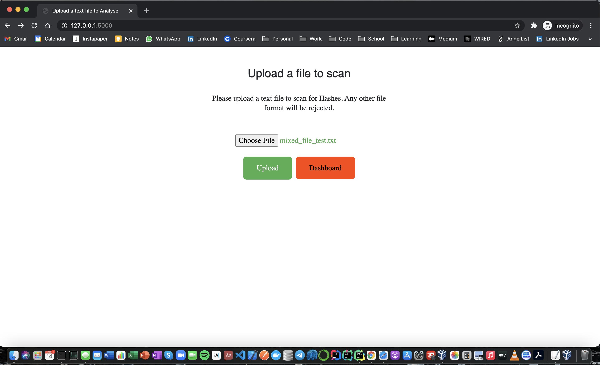
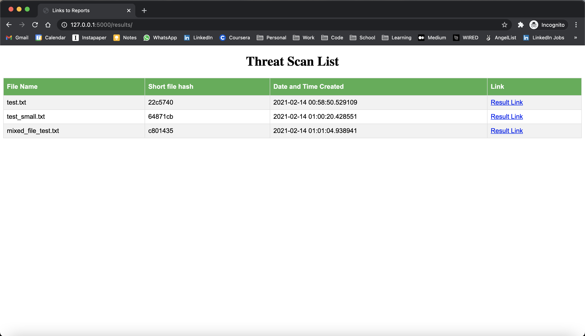
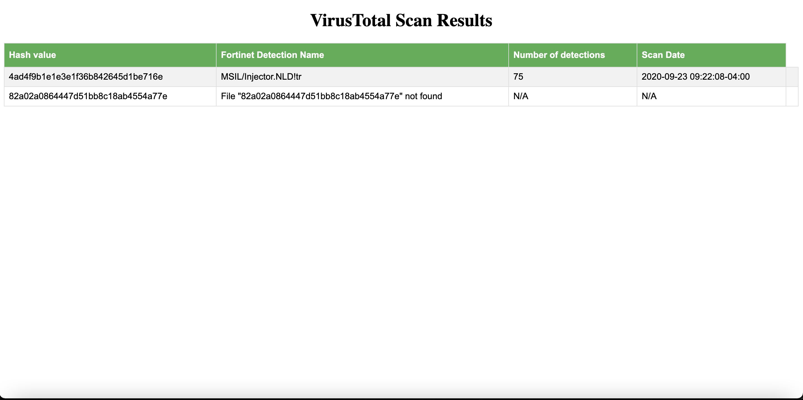
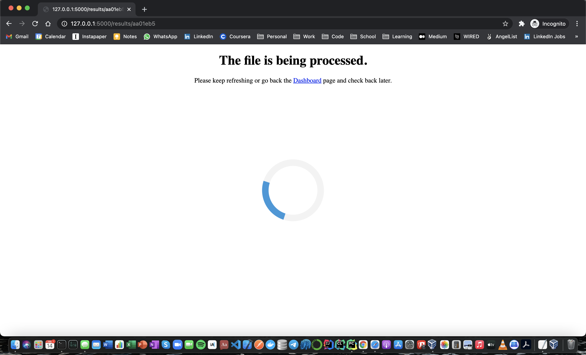
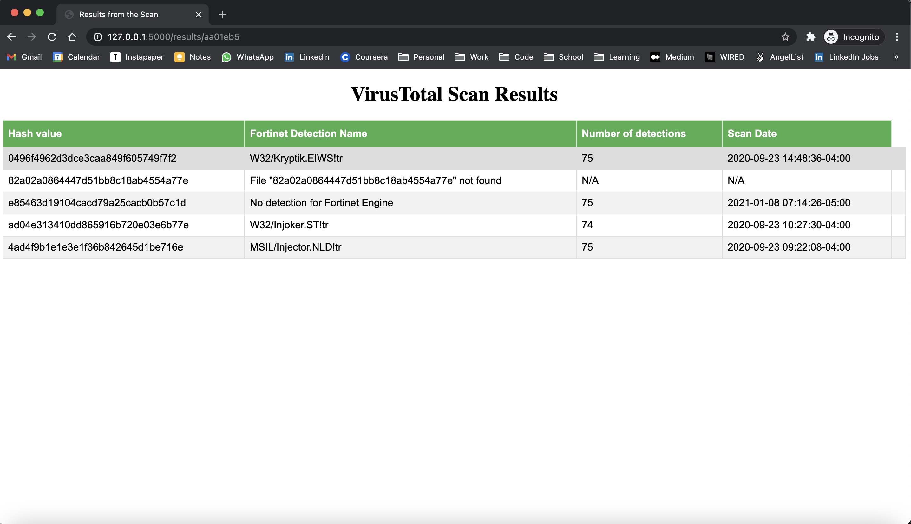
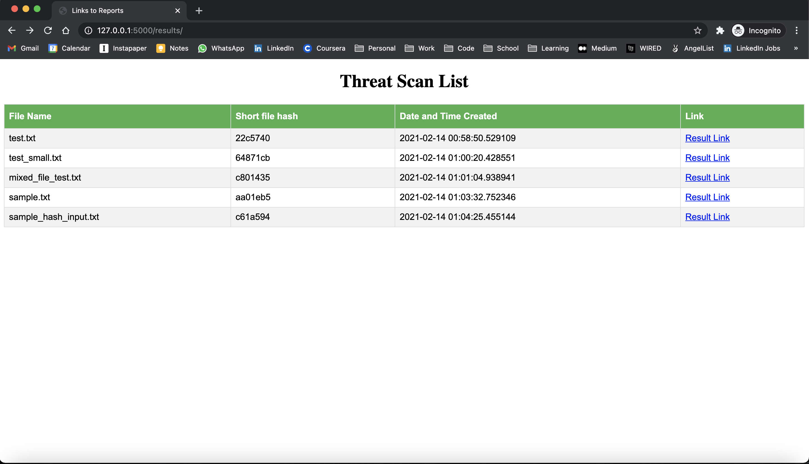
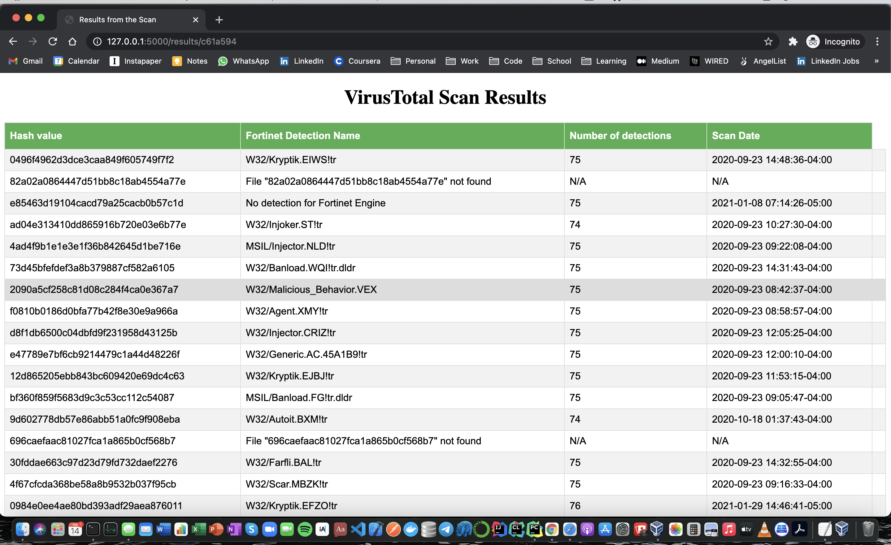
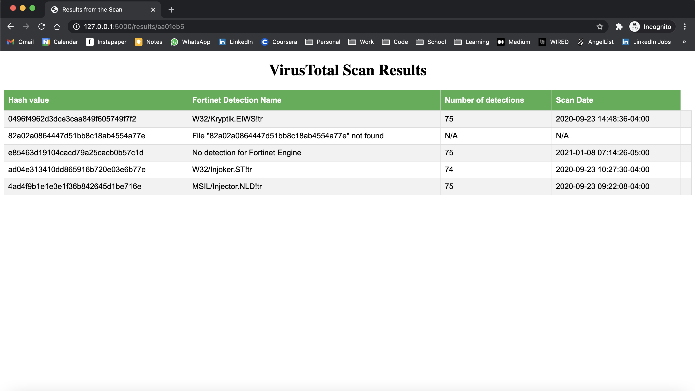

# Threat Analyzer : Project Description

This project builds a minimal threat analyzer using the VirusTotal's Public API.
It checks the list of hashes (Uploaded in a form of text file) against the virustotal.com database using their Public API.

### Here are some features of the Project.

1. Built with Python MicroFramework Flask. A user can upload a text file for analysis.
3. Does file validation and displays error messages if the file is of the wrong type.
4. The Process is totally Async. A user can upload the file and check the results later in the dashboard.
5. Dashboard consists of File Name, Shortened File Hash, Time Created, Link to the results.
6. If the file is being processed, the results page shows a loading icon.
7. User can upload any number of files as long as they honor API Rate limits.
8. Results page is public and other users can view your results. (Due to time constraints I could not implement User Sessions).
9. Applications also implements Cache and stores all the scan results that are less than a day old so that they can be retrieved quickly.

## Tech Stack

Python3, Flask, Celery, Redis, Linux (Test on Ubuntu VM) , Basic HTML and CSS.

## Installation Instructions and Dependency:

1. **Install Python 3:** (Python 3.8 Preferred as it was used in the development)
    (Installation instructions vary by LinuX Distro.)
    This Link has good advice : https://docs.python-guide.org/starting/install3/linux/
   

2. **Install Pip:** Pip is required for Installation of packages.
    NOTE : If you installed Python using package manager. Please also install pip using the same.
    (use your Package manager or from a source using https://pip.pypa.io/en/stable/installing/)    

3. **Install and activate Virtual Environments:**
    It is helpful to organize python packages in a virtual environment to that they don't affect your system.
    
    Example :  
                ` python3 -m venv forti-assessment-env`  
              `source forti-assessment-env/bin/activate`
     
     
   
 4. Install dependencies from requirements.txt
    `pip install -r requirements.txt`
     
     

 5. **Install and run Redis:**
    You can refer to Redis official docs (https://redis.io/topics/quickstart) or run the following commands.  

    `wget http://download.redis.io/redis-stable.tar.gz`  
    `tar xvzf redis-stable.tar.gz`  
    `cd redis-stable`  
    `redis-server`  
     
    
    The last command above will start the redis server.
    It is a good idea to copy both the Redis server, and the command line interface into the proper places, either manually using the following commands:  

    `sudo cp src/redis-server /usr/local/bin/`  
    `sudo cp src/redis-cli /usr/local/bin/`  
    Or just using sudo make install.
      
    I assume that /usr/local/bin is in your PATH environment variable so that you can execute both the binaries without specifying the full path.   
    
 6. **Setup Environment variables and Flask**    
    First, Setup all the environment variables for the project using `setup_envs.sh` and now run flask using the following commands   
    `export FLASK_ENV=development`  
    `export FLASK_APP=app.py`  
    `flask run`  

     
    
 7. **Start Celery worker** (IMPORTANT)
      Celery helps facilitate the background process running and Asynchrony in our application. It should be started after the flask application.    
      
      Use the following command to start a Celery worker   

      `celery -A app.celery worker --loglevel=INFO`
    
      
      In the above command app stands for flask app file name and .celery is the name of the celery object
      in the application, and we are logging the output to console suing `--loglevel`

Application is ready for use. Go to `http://127.0.0.1:5000/`

## Issues Encountered and Addressed

1. **File Validation** : Making Sure that only text files are parsed and only Md5 and SHA-256 were parsed in the file. Addressed with the help of Flask File parsing modules and Regular expressions.
2. **API Rate Limit** : Dealing with API Rate limits and pausing requests when timeouts occurred. Addressed using time.sleep module and caching using Redis.
3. **Async Tasks** : Creating and Executing background tasks and constantly querying them for updates.
4. **Celery and Message Queues** : Setting up and using messaging to enable Async capacity using Celery. Documentation was helpful in calrifying errors and concepts.

## Screenshots:

